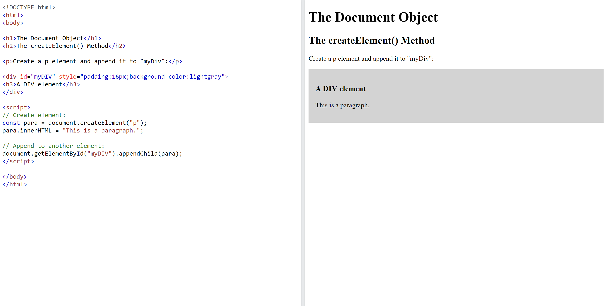
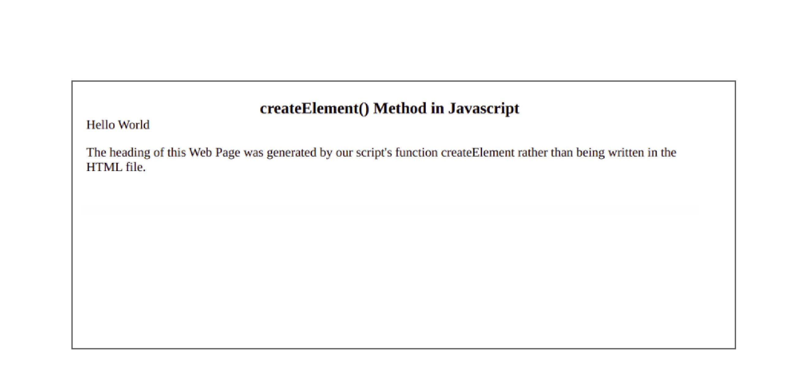
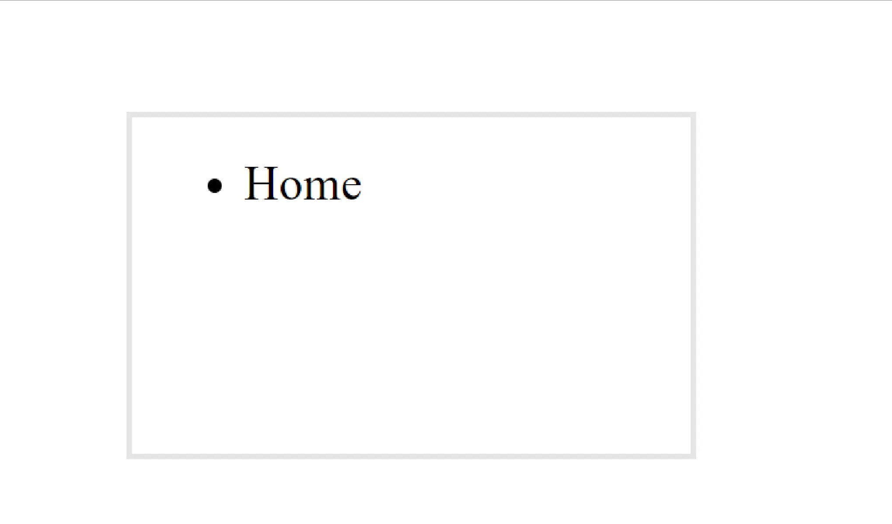

# DOM Contd.
# At the end of the session , you will be able to :

- Understand how to create new DOM elements in JavaScript using the createElement method.
- Understand how to append child elements to a parent node using the appendChild method.
- Understand how to remove child elements from a parent node using the removeChild method.
## Creating a DOM Element:

To create a DOM element in JavaScript, you can use the createElement() method of the document object. This method takes a string argument representing the tag name of the element you want to create. You can then set the attributes and contents of the element using various methods and properties.

While working with Web Pages, traditionally we write some content, more formal elements which get rendered on the page, but this all is static we cannot add the content dynamically with the help of HTML.

Here javascript comes into the picture, let's keep our discussion limited to the createElement method. This method can be called by the document object, it accepts the tagName like h1, p, div, button, etc, and some additional options.

Subsequently, it returns an HTML element that is equivalent to the element we write inside the .html file. We can insert the returned element into the HTML file so that the content can be rendered on the web page.

Here is an example of how to create a div element and set its id attribute:

```js
const div = document.createElement('div');
div.id = 'myDiv';

```

## Example:



## Additional Configurations

In this example, we will use some extra javascript functions and APIs to manipulate the HTML content. See the explanation section for more description.

### Html

```html

<!DOCTYPE html>
<html>

<body>
  <div id="hello">
    Hello World
  </div>
  <p>
    The heading of this Web Page was generated by our script's function createElement rather than being written in the
    HTML file.
  </p>
</body>
<script src="./myscript.js"></script>

</html>

```

### Script.js 

```js
//Create a new div element
const createdElement = document.createElement('div')

//Check what is being created
console.log(createdElement)

//Provide some styles
createdElement.style.textAlign = 'center'
createdElement.style.fontSize = '20px'
createdElement.style.fontWeight = 550

//Give it some content, which means create text Node
const textNode = document.createTextNode('createElement() Method in Javascript')

// add the text node to the newly created div
createdElement.appendChild(textNode)

// add the newly created element and its content into the DOM
const existingDiv = document.getElementById('hello')

//Insert before a specified element "existingDiv"
document.body.insertBefore(createdElement, existingDiv)
```



## Appending child to a parent element:

To add a child element to a parent element in the DOM, you can use the appendChild() method of the parent element. This method takes a single argument, which is the child element you want to add.

Here is an example of how to add a p element to a div element:

```js
const div = document.createElement('div');
const p = document.createElement('p');
div.appendChild(p);
```

In the below example, we are having an unordered list with only 1 child, and then using JavaScript's appendChild() method, we are adding more child elements to the parent list

```js
// HTML starts here
<!DOCTYPE html>
<html lang="en">
  <head>
    <title>JavaScript appendChild() method</title>
  </head>
  <body>
    <ul class="menu">
      <li>Home</li>
    </ul>
  </body>

  // JavaScript starts here
  <script>
        
    // function definition to create a new element
    const creatingMenuItems = (name) => {
      let liElement = document.createElement("li");
      liElement.textContent = name;
      return liElement;
    };

    // getting the ul element having className as the menu
    const menu = document.querySelector(".menu");

    // adding new child items to the menu element
    menu.appendChild(creatingMenuItems("Services"));
    menu.appendChild(creatingMenuItems("Contact"));
    menu.appendChild(creatingMenuItems("About Us"));
  </script>
</html>
```

###  Output before using appendChild() method




### Output after using appendChild() method


## Removing a child element from a parent node:

To remove a child element from a parent element in the DOM, you can use the removeChild() method of the parent element. This method takes a single argument, which is the child element you want to remove.

We have learned about JavaScript nodes. When we create a node, we refer to it as the root node, and the nodes that come from it are called child nodes.

It is possible to remove a child node from its parent node using JavaScript removeChild() method. Therefore, The JavaScript removeChild() method is used for removing a child node from its parent node.

There are several ways to remove a child element from the parent node. Let's look at them:

Clearing innerHTML - Because this approach invokes the browser's HTML parser, it may not be suitable for high-performance applications.
Looping to remove every lastChild - If it's faster to check for firstChild than lastChild, the loop continues to check for the firstChild.

Here is an example of how to remove a p element from a div element:

```js
const div = document.querySelector('div');
const p = div.querySelector('p');
div.removeChild(p);
```
Let's take an example to understand removechild in Javascript where we have a nested div inside a div element in our HTML document with some JavaScript.

```js
<!--Code to remove the child element from the parent element--> 
<html>  
<body>  
<div id="parentID">
	I am a parent
  <div id="childID">
    <p>I am a child!</p>
  </div>
</div>
<script>  
	let parentElement = document.getElementById("parentID");
	let childElement = document.getElementById("childID");
	parentElement.removeChild(childElement);  
</script>  
</body>  
</html>  
```
In the above example, we can use JavaScript removeChild() method to remove the child element inside the parent element.

The below code represents a parent element and a child element inside it.

```html
<div id="parentID">
	I am a parent
  <div id="childID">
    <p>I am a child!</p>
  </div>
</div>
```

Let's see the JavaScript code to remove the child element:

```
let parentElement = document.getElementById("parentID");
let childElement = document.getElementById("childID");
parentElement.removeChild(childElement);
```

If we execute the above code, it gives the following output:

```
I am a parent
```

As you can see in the output above, the child element that was inside the parent element has been deleted. And at last, only the parent div will remain as <div id="parentID"></div>.

The child element and any other elements nested within the child element will be removed.


## Implement Filtering Feature based on gender Value:

To implement a filtering feature based on gender value, you can use JavaScript to loop through a list of elements and hide or show them based on their gender value. Here is an example of how to do this:

```js
<input type="radio" name="gender" value="male" onclick="filterList()"> Male
<input type="radio" name="gender" value="female" onclick="filterList()"> Female

<ul id="myList">
  <li data-gender="male">John</li>
  <li data-gender="male">Mike</li>
  <li data-gender="female">Jane</li>
  <li data-gender="female">Mary</li>
</ul>

<script>
function filterList() {
  const gender = document.querySelector('input[name="gender"]:checked').value;
  const listItems = document.querySelectorAll('#myList li');
  listItems.forEach(item => {
    if (item.dataset.gender === gender || gender === 'all') {
      item.style.display = 'block';
    } else {
      item.style.display = 'none';
    }
  });
}
</script>
```

## Some other real life Example:

- Gender filter in dating apps, etc.


# Class Assignment (to be done in class)

## Filtering a List based on Gender:

***Create an HTML page with a list of at least 10 people's names and genders.Write a JavaScript function that reads the selected gender from a set of radio buttons and displays only the names of people with that gender in the list, hiding the others.Add a **_"Show All"_** button that, when clicked, displays all the names in the list again***
